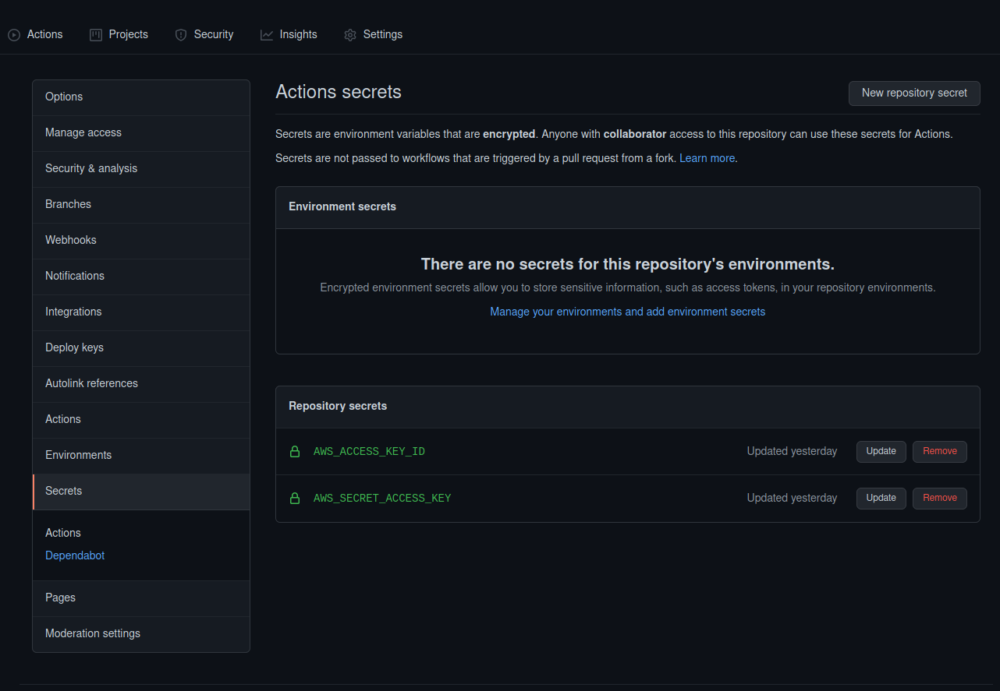
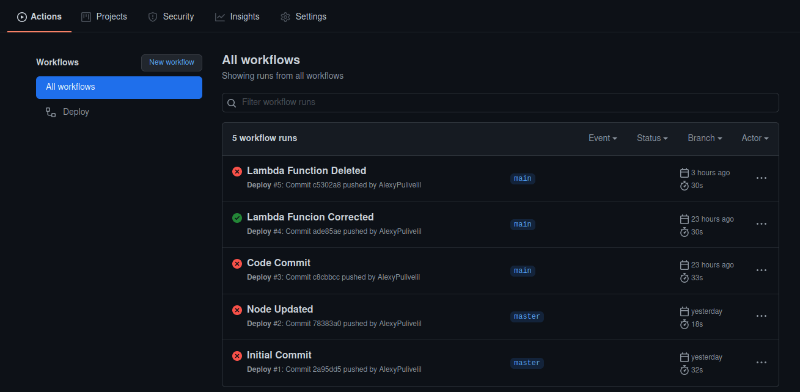

# How to deploy a lambda function using github actions?

# Part 1
Before setting up the GitHub actions, you need to carray out few steps
1. Create a lambdafunction
2. Create a trigger(API Gateway)
3. AWS Credentials

# Part2
## GitHub Actions Workflow

If you are using this code make sure you install all the packages
1. `npm i`
2. `npm i --save typescript`
3. `npm i --save lodash`
4. `npm i --save-dev @types/lodash @types/node @types/aws-lambda @vercel/ncc`


Check `main.yml` file in the workflow section for the full code

Name as deploy <br>
`name: Deploy`

Mention the branch which you are using for the workflow
```yml
on:
  push:
    branches:
    - main
```

Next mention the jobs with the correct version you are using in the lambda
```yml
jobs:
  deploy_lambda:
    runs-on: ubuntu-latest
    steps:
      - uses: actions/checkout@v2
      - uses: actions/setup-node@v2
        with:
          node-version: '14'
```
Next you need to set-up aws credentials

```yml
- name: Configure AWS Credentials
        uses: aws-actions/configure-aws-credentials@v1
        with:
          aws-access-key-id: ${{ secrets.AWS_ACCESS_KEY_ID }}
          aws-secret-access-key: ${{ secrets.AWS_SECRET_ACCESS_KEY }}
          aws-region: ap-south-1
```

In each repository you can set up AWS Access Key and Scret Key hiddien. There is a feature in GitHub itself.

1. After selecting the repository click the settings. 
2. Select Secrets
3. Here create a sapce for saving AWS Access Key and Scret Key. (Make sure the name given here matchs at the yaml file)

Now install the runtime 
```yml
- name: npm install
        env:
          CI: true
        run: |
          npm ci
```
Next give the name and run the main file. In this case it `index.ts`
Also make sure you give the correct lambda function name
```yml
- name: deploy
        run: |
          npx ncc build index.ts
          zip -j deploy.zip ./dist/*
          aws lambda update-function-code --function-name=<addlambdafunctionname> --zip-file=fileb://deploy.zip

```
Once its done check the workflow, you can see the workflow the being deployed.



Refrence : https://www.youtube.com/watch?v=UQiRhKgQ5X0
