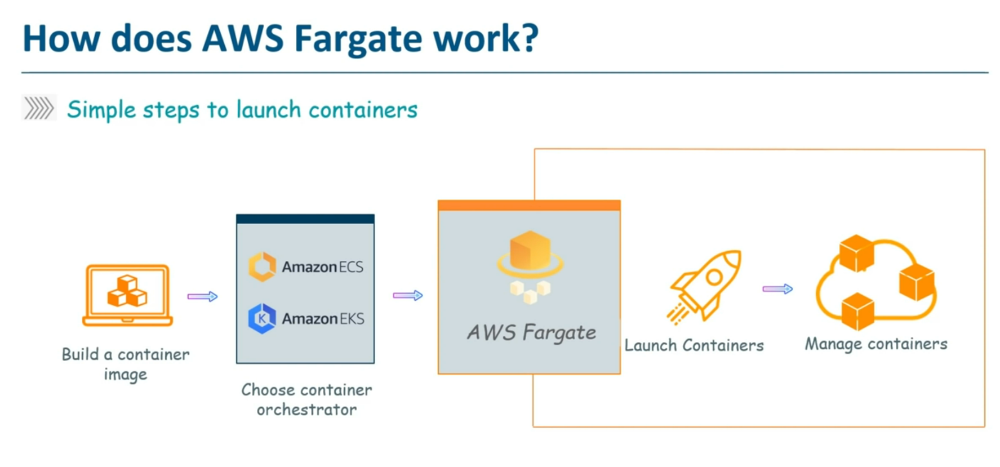

# Server vs Serverless

1. Scalability <br>
        A **Server** does not scale up or down. It has a capacity that cannot be exceeded, and its resources stay available even if they’re not being used (being effectively wasted).
        **Serverless** systems automatically scale server instances up and down to handle load. You do nothing to achieve this behavior.

2. Maintenance <br>
            A **Server** requires maintenance. If you run a server, you might have to monitor it, install software, install patches, tune it, and other operations. You have to figure out how to deploy your code to it.
            **Serverless** system require no maintenance. The cloud provider handles all these details of managing the underlying hardware. You just write and deploy code using tools provided by the cloud vendor.

3. Cost
            A **Server** has some ongoing cost associated with it. Typically costs are paid on an hourly, daily, or monthly basis just to keep the server up and running, even if it’s not being used.
            **Serverless** systems are billed per function invocation. When you deploy code to a serverless backend, you will be charged for resources uses (invocations, memory, bandwidth). If you use nothing, you are charged nothing.
4. Programming paradigm
                A **Server** allows you to deploy services that run on an ongoing basis. You can typically log in and run whatever programs you want, whenever you want, for as long as you want.
                **Serverless** systems are event-driven by nature. You deploy code that runs in response to events that occur in the system. These can be things like database triggers that respond to changes, or HTTP requests that serve an API. Code does not run outside of the context of handling some event, and it is often constrained by some time limits.

Serverless Computing VS Containers
1. Physical machines
            **Serverless** computing actually runs on servers, but it is up to the serverless vendor to provision server space as it is needed by the application; no specific machines are assigned for a given function or application.
            Each **container** lives on one machine at a time and uses the operating system of that machine, though they can be moved easily to a different machine if desired.

2. Scalability
            In a **container-based architecture**, the number of containers deployed is determined by the developer in advance
            In a **Serverless architecture**, the backend inherently and automatically scales to meet demand.

3. Cost
            **Containers** are constantly running, and therefore cloud providers have to charge for the server space even if no one is using the application at the time.
            There are no continued expenses in a **Serverless** architecture because application code does not run unless it is called. Instead, developers are only charged for the server capacity that their application does in fact use.
4. Maintenance
            **Containers** are hosted in the cloud, but cloud providers do not update or maintain them. Developers have to manage and update each container they deploy.
            **Serverless** architecture has no backend to manage. The vendor takes care of all management and software updates for the servers that run the code.

# Tools
## DevOps planning tools
1. JIRA
2. Redmine
3. Trac
4. Rally.

## DevOps build tools 
It helps in project management i.e building and documenting the project.
1. Apache Maven - For Java-based projects
2. Visual Studio

## DevOps CI/CD tools
1. Jenkins
2. Bamboo
3. Codeship
4. Github Actions

## DevOps Provisioning, Version Conrol tools
Infrastructure As A Code
1. Ansible
2. AWS Cloud Formation
3. Chef
4. Git
5. Gutlab
6. Puppet
7. Terraform

## DevOps Software testing tools
1. SonarQube
2. Selenium

## DevOps Deployment tools
1. AWS CodeDeploy
2. Go
3. Google Deployment Manager

## DevOps monioring tools
1. Datadog
2. Elasticsearch
3. Grafana
4. Kibana
5. Pagerduty
6. Splink

## DevOps log management tool
1. Logstash

## DevOps Container tools
1. Docker
2. Kubermetes
3. Linux Container

## DevOps virtualization tools
1. Vagrant
2. Virtual Box
3. VMware
4. Xen

# Which is best ?
**Git** - To manage different Versions of source code. <br>
Its an easy to learn tool and most of the delevepors knew how to use it. We can work loclly and can push to remote repository like Github/Gitlab. <br>
**Jenkins** - For continuous integration <br>
When a code is pushed to Github, Jenkins can trigger a build and ```war file``` will be genearted. In case of a successful build, the built application (or executable) is deployed to the test server. If there are no build, integration, and testing issues with the code, the changes and tested application are automatically deployed to the Production server. <br>
NB: A single Jenkins server might not be sufficient to handle the load that comes with large-scale software projects. <br>
**ECS** is useful for applications that are already embedded in the docker/containers <br>
To run docker containers, you need some kind of infrastructure.
1. Serverless option known as AWS Fargate that removes the need for you to interact with or think about servers or clusters.
2. Using EC2. Here users need to take care of software upgrades, patches, identifying security vulnerabilities etc <br>

**Docker** 
1. Running Docker on EC2
2. Running Docker on ECS
3. Running Docker on Fargate
4. Running Docker on EKS

**Terraform**/**Ansible** for infrastructure management and provisioning i.e builing the infrastructure. Ansible is used to add, update, delete and manage the configuration of the IT infrastructure, whereas Terraform is used to declare infrastructure components and orchestrate them across multiple cloud providers. <br>
1. Terraform - Integration with continuous integration platforms like GitLab and Jenkins for deploying DevOps pipelines is easy. <br>
2. Ansible - It uses human-readable YAML files for configuration management. <br>

